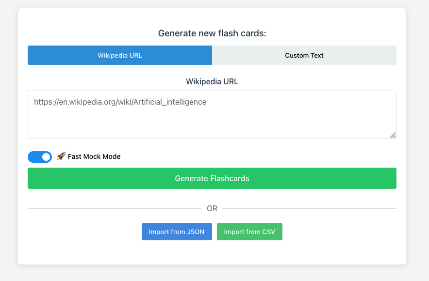

# AI Enhanced Coding Workshop

## Context

In this workshop, you'll work with a flashcard generation application that extracts learning content from Wikipedia articles or custom text. Built with React and TypeScript, the app uses a server proxy for LLM API interactions following OpenAI's documentation standards. The application allows users to generate, view, and export flashcards in various formats including JSON and CSV.

## Setup

Clone the repository from [GitHub](https://github.com/Patryk-Kuchta/ai-enhanced-coding-exercise):

```bash
git clone https://github.com/Patryk-Kuchta/ai-enhanced-coding-exercise.git
```

> You're welcome to fork the repository and work on your own version if preferred!

## Running the App

Refer to the `README.md` file for detailed setup instructions to run the app locally. Familiarize yourself with the commands for running, linting, and testing the application. Don't hesitate to ask questions if you encounter any issues.

> Note: The Trainer will provide you with the necessary .env file.

## Exploring the App

Before starting the exercises, generate some sample flashcards:

1. Find an interesting Wikipedia article (the more unusual, the more entertaining the flashcards!) - try using the random article generator: https://en.wikipedia.org/wiki/Special:Random
2. Paste the link into the application
3. Disable the Mock response toggle
4. Generate the flashcards

Explore the generated flashcards by flipping through them and testing the export functionality. Download both JSON and CSV exports as you'll need these files for the upcoming exercises.

## Exercise

### Part 1: Feature Implementation

For this part, remain on the `main` branch - this represents the codebase before AI tooling optimization.

Your task is to implement two new features:
- An `Import JSON` button
- An `Import CSV` button

Use Windsurf to ask questions about the contents of the repository, if in doubt, don't hesitate to ask the trainer.

Both buttons should be added to the initial input form and should direct users to the same viewer page used for displaying generated flashcards. Use Windsurf to assist with the implementation, but make sure to review and understand all generated code. Write tests for these new features, also using Windsurf where appropriate.

Focus your work on the following directories:
- `src/components`
- `src/styles`
- `tests/components`

Reminder of what a good AI workflow includes:
- Familiarise yourself with the codebase structure. You can ask Windsurf to give you an overview.
- Enable planning mode and toggle 'write' mode in Windsurf's Cascade Window.
- In Cascade Window, Write the feature requirements. Use @folder to help Cascade determine the context. Ask to create an implementation plan and let you review it before proceeding.
- Read through the plan, edit if needed, and when happy ask Cascade to implement the plan (if you edited the plan, mention it in the prompt)
- See if the feature works as expected in the browser. You may want to paste any error messages into Cascade.
- Have a read through the generated code. You can ask Cascade to explain anything you don't understand (select the lines in editor and hit ctrl/cmd + shift + L
- If you haven't in the original plan, ask Cascade to write and run unit tests for the new functionality. They should all be passing.

### Part 2: AI Optimization Comparison

After completing Part 1, save your changes and switch to the `ai-optimized` branch:

```bash
# Commit your changes from Part 1
git add .
git commit -m "Implemented import JSON and CSV buttons for part 1"

# Switch to the optimized branch
git checkout ai-optimized
```

This time, make sure to follow this design - using images and browser mode.



Implement the same features on this branch. As you work, document:
- What differences you notice in the AI-optimized codebase
- Where Windsurf performs better
- Areas where Windsurf still faces challenges

### Stretch Goals

If you complete all parts of the exercise, experiment with additional features using Windsurf. Remember to carefully review all AI-generated code rather than accepting it without scrutiny. Some feature ideas include:

- A button to generate additional flashcards
- Automatic fetching of article titles from Wikipedia
- Temperature control options for the LLM
- Support for additional export/import formats (e.g., YAML)
- Any ideas for features you have!

Another idea is to use your experiences in Parts 1 and 2 and develop a plan to enhance the application's compatibility with Windsurf. Implement your improvements in the `.windsurfrules` file.
