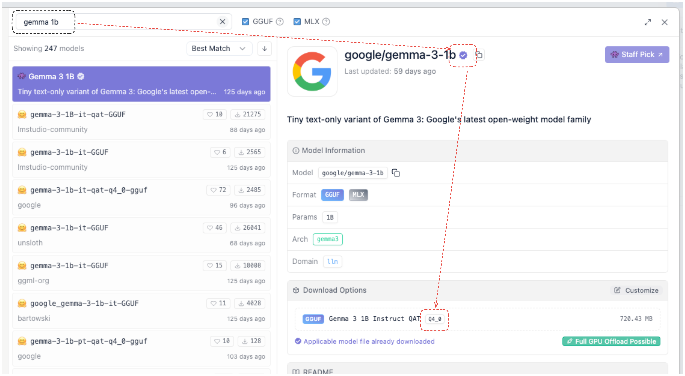
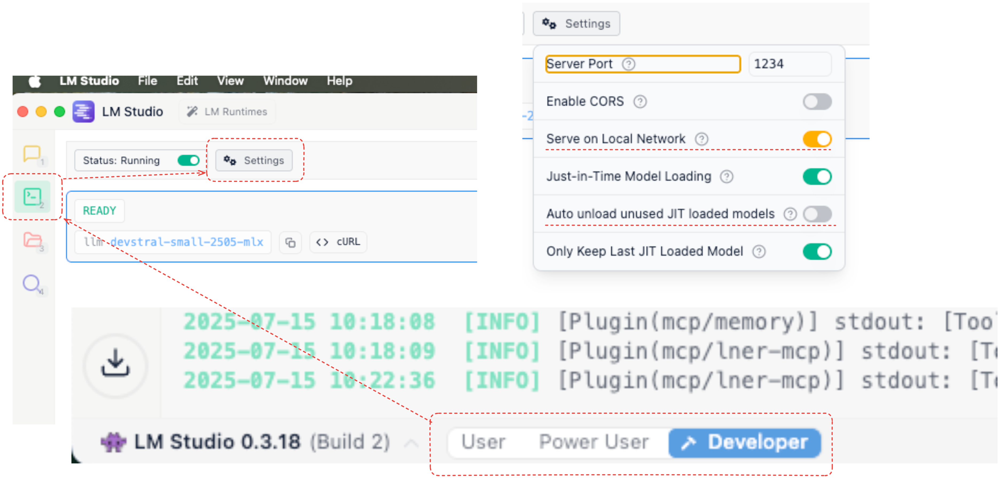
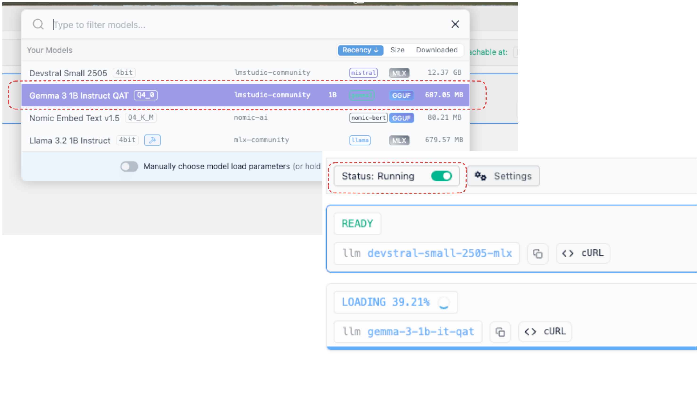
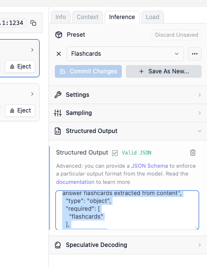

# Trainer Setup Guide

## Setting up LM Studio

1. Install LM Studio from [https://lmstudio.ai/](https://lmstudio.ai/)

2. Install a small model for inference:
   - Recommended: [Google Gemma 3 1B](https://lmstudio.ai/models/google/gemma-3-1b)
   - Use any Q4 quantization option for optimal performance



3. Configure the server settings:
   - Enable developer mode
   - Navigate to the server tab
   - Open settings and set:
     - "Serve on Local Network" to **True**
     - "Auto unload unused JIT loaded models" to **False**



4. Load the downloaded model and ensure the server is running



5. Test the server:
   - Copy the cURL command using the button next to the model
   - Paste it into a bash terminal to verify the server is responding

6. Configure structured output:
   - In the right pane under "Inference", find the "Structured Output" section
   - Enable the feature by ticking the checkmark
   - Input the following JSON schema:

```json
{
  "$schema": "http://json-schema.org/draft-07/schema#",
  "title": "Flashcards Response",
  "description": "A collection of question-answer flashcards extracted from content",
  "type": "object",
  "required": [
    "flashcards"
  ],
  "properties": {
    "flashcards": {
      "type": "array",
      "description": "An array of flashcard objects",
      "items": {
        "type": "object",
        "required": [
          "question",
          "answer"
        ],
        "properties": {
          "question": {
            "type": "string",
            "description": "The question part of the flashcard"
          },
          "answer": {
            "type": "string",
            "description": "The answer part of the flashcard"
          }
        },
        "additionalProperties": false
      }
    }
  },
  "additionalProperties": false
}
```



## Setting Up Environment Variables

1. Create your environment file:
   - Copy the `.env.template` file to `.env`
   - Set the model name to match the model you downloaded in LM Studio
   - (You can copy the exact name using the copy button next to the model name in LM Studio)

2. Find your VPN IP address:
   - Run the following command in your terminal:
   ```bash
   ifconfig | awk '/utun/{iface=$1} /inet /{print iface ": " $2}'
   ```
   - This will display localhost (127.0.0.1) and your VPN IP address

3. Configure the inference server URL in your `.env` file:
   ```
   INFERENCE_SERVER_URL=http://YOUR_IP_ADDRESS:1234/v1
   ```
   - Example: `INFERENCE_SERVER_URL=http://10.0.0.26:1234/v1`
